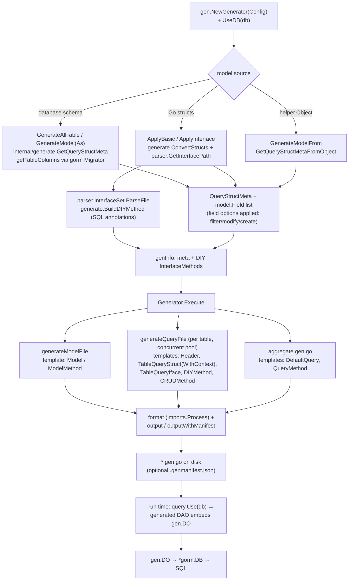

# Gen Architecture

This document describes how [GORM Gen](https://github.com/go-gorm/gen) is put together, for
contributors who want to change the generator, the runtime query builder, or the generated-code
contracts. It was written from a static reading of the source tree; inferred design rationale is
explicitly marked as *inference*.

## 1. Positioning

Gen is GORM's type-safe data-access layer generator. It ships as **one Go module, `gorm.io/gen`,
with two faces**: (a) a **compile-time code generator** that reflects over a live database schema
(or over hand-written Go structs) and emits model structs plus per-table "DAO" query objects, and
(b) a **runtime query-builder** (`gen.DO` and the `field` expression package) that the generated
code delegates to at application run time. In the GORM ecosystem it sits directly on top of
`gorm.io/gorm` — the generator uses `gorm.DB`'s `Migrator()` for schema reflection, and the
generated DAOs wrap a `*gorm.DB` for execution — so Gen never replaces GORM; it adds a typed,
refactor-safe API over it. Sister packages such as `gorm.io/datatypes` (JSON columns) and
`gorm.io/hints` integrate through Gen's condition and clause mechanisms (see `condition.go`,
`sec_check.go`).

## 2. High-level pipeline

A user program (or the standalone CLI in `tools/gentool/`) constructs a generator, feeds it
tables/models and optional custom interfaces, then calls `Execute()`:

1. `gen.NewGenerator(gen.Config{...})` — `NewGenerator` (generator.go) normalizes the config via
   `Config.Revise()` (config.go): resolves `OutPath`/`OutFile`, defaults `ModelPkgPath` to
   `model.DefaultModelPkg`, and opens a dummy dialector if no DB was supplied.
2. `g.UseDB(db)` attaches the live `*gorm.DB`.
3. Model acquisition, one of:
   - `GenerateModel` / `GenerateModelAs` / `GenerateAllTable` — reflect over real DB tables;
   - `GenerateModelFrom(helper.Object)` — build a model from a code-defined object;
   - `ApplyBasic` / `ApplyInterface` — reuse existing Go structs (parsed with
     `generate.ConvertStructs`) and, for `ApplyInterface`, attach DIY query methods parsed from
     user interfaces.
4. `g.Execute()` renders everything through `text/template` into `OutPath`:
   `generateModelFile()` writes one `<table>.gen.go` per model; `generateQueryFile()` writes one
   `<table>.gen.go` DAO file per table plus the aggregate `gen.go` (`Use`, `SetDefault`, `Query`).
   Output is gofmt'ed/`goimports`-fixed by `imports.Process` in `Generator.format`.
5. At run time, the user's application calls `query.Use(db)` (generated) and composes type-safe
   chains (`u.WithContext(ctx).Where(u.Age.Gt(18))`) that bottom out in `gen.DO` methods, which
   drive the wrapped `*gorm.DB`.



## 3. Module map

The repository root is the importable library (`gorm.io/gen`). `examples/`, `tests/`, and
`tools/gentool/` are **separate Go modules** with their own `go.mod`.

| Path | Responsibility | Key files |
|---|---|---|
| `/` (root) | Public generator API + runtime DAO | `config.go`, `generator.go`, `field_options.go`, `interface.go`, `import.go`, `manifest.go` |
| `/` runtime | `gen.DO` query builder, generic DO, security checks, diagnostics | `do.go`, `generics.go`, `do_options.go`, `condition.go`, `sec_check.go`, `diagnose.go` |
| `field/` | Typed column expressions used by both generated code and users | `field.go`, `expr.go`, `export.go` (`NewField`), `string.go`, `number.go`, `bool.go`, `time.go`, `asterisk.go`, `association.go`, `serializer.go`, `tag.go`, `assign_attr.go` |
| `helper/` | Escape hatch to define models purely in code (no DB, no struct) | `object.go` (`helper.Object`), `clause.go` |
| `internal/model/` | Field/column data model and per-field option machinery | `config.go`, `base.go` (`model.Field`), `options.go`, `tbl_column.go` (`Column.ToField`) |
| `internal/generate/` | Schema/struct → `QueryStructMeta`; DIY method validation | `export.go`, `generate.go` (`getFields`), `query.go` (`QueryStructMeta`), `table.go` (DB reflection), `interface.go`/`section.go` (DIY SQL), `clause.go` |
| `internal/parser/` | AST parsing of user interfaces for DIY methods | `parser.go` (`InterfaceSet.ParseFile`), `export.go` (`GetInterfacePath`), `method.go` |
| `internal/template/` | All generated-code templates as Go string constants | `base.go` (`Header`), `struct.go`, `query.go`, `method.go`, `model.go` |
| `internal/diagnostic/` | Structured, machine-readable generator errors | `diagnostic.go`, `codes.go`, `codeframe.go` |
| `internal/utils/pools/` | Tiny concurrency pool used by `Execute` | — |
| `tests/` | Integration test module + golden fixtures | `tests_test.go`, `generate_test.go`, `.expect/` (dal_1…dal_8, `dal_generic`, `dal_test`), `test.sh`, `docker-compose.yml` |
| `tools/gentool/` | Standalone config-file-driven CLI (`gen.yml`) | `gentool.go` (`parseArgs`, `gen.NewGenerator`) |
| `examples/` | Runnable scenarios; `examples/dal/` is checked-in generated output | `generate.sh`, `cmd/<scenario>/` |

There is **no Makefile**; build/test entry points are plain `go test` and shell scripts (§9).

## 4. The two faces of Gen

### 4a. Compile-time generation

Everything under `internal/` plus the root files `config.go`, `generator.go`,
`field_options.go`, `manifest.go` only runs inside the user's `go run ./cmd/generate` style
program (or gentool). The generator never links into the served application unless the user also
imports the runtime — both faces live in the same package for convenience (*inference*: this is
why `doc.go` describes the package as both generator and query API, and why `config.go` lazily
opens a `tests.DummyDialector` so a generator can be constructed without a DB).

Templates are `text/template` constants selected by `GenerateMode` bits (config.go):

- `WithDefaultQuery` — also emit the `Q`/`SetDefault` globals (`tmpl.DefaultQuery`);
- `WithoutContext` — use `tmpl.TableQueryStruct` instead of `...WithContext`;
- `WithQueryInterface` — emit a `I<Model>Do` interface (`tmpl.TableQueryIface`);
- `WithGeneric` — emit `CRUDGenericMethod` and a `GenericsDo`-backed DO struct
  (`tmpl.DefineGenericsMethodStruct`).

### 4b. The runtime query builder

`do.go` defines `DO`, an immutable-by-clone chainable builder around `*gorm.DB`:

```go
type DO struct {
    *DOConfig
    db        *gorm.DB
    alias     string
    modelType reflect.Type
    tableName string
    backfillData interface{}
}
```

Every chainable method (`Where`, `Select`, `Order`, `Join`, `Attrs`, …) derives a new statement
via `d.getInstance(d.db.Clauses(...))`; finishers (`Create`, `Find`, `Update`, `Delete`, `Rows`,
`Scan`, …) execute through the wrapped `*gorm.DB` and return `ResultInfo{RowsAffected, Error}`.

Generated code ties into this by **embedding** `gen.DO`:

```go
// internal/template/struct.go, DefineMethodStruct
type {{.QueryStructName}}Do struct { gen.DO }
```

and each generated `<table>.gen.go` constructor (template `createMethod`) does:

```go
_x.UserDo.UseDB(db, opts...)
_x.UserDo.UseModel(&model.User{})
_x.ALL = field.NewAsterisk(tableName)
_x.ID = field.NewInt64(tableName, "id") // typed field.Expr per column
```

so `Where(u.Age.Gt(18))` produces a `field.Expr` (a `Condition`, see `interface.go`), which
`DO.Where` converts to GORM `clause.Expression`s via `condToExpression` (condition.go). Because
`DO` itself implements `Condition.BeCond()` by dumping its accumulated WHERE expressions, a DAO
can be nested as a subquery (`Dao` embeds `SubQuery`). `interface.go` defines the contracts:
`Condition`, `SubQuery`, and the wide `Dao` interface; `var _ Dao = new(DO)` pins `DO` to it.

For the generics mode, `generics.go` provides `IGenericsDo[T, E]` and
`GenericsDo[T IGenericsDo[T, E], E any]`, which wrap a `Dao` and re-expose the API with concrete
element type `E` (`Find() ([]E, error)` etc.); generated generic DOs wire the self-reference
through `IWithDO`/`WithDOFunc[T]`.

## 5. Walk-through: generate models + DAO from an existing MySQL schema

1. **Setup** — the user writes:
   ```go
   g := gen.NewGenerator(gen.Config{
       OutPath: "./query", Mode: gen.WithDefaultQuery | gen.WithQueryInterface,
   })
   g.UseDB(gormDB) // mysql via gorm.io/driver/mysql
   ```
2. `GenerateAllTable()` (generator.go) calls `g.db.Migrator().GetTables()` and loops over
   `GenerateModel(tableName)`.
3. `GenerateModelAs` → `generate.GetQueryStructMeta(g.db, g.genModelConfig(...))`
   (internal/generate/export.go).
4. `GetQueryStructMeta`:
   - rejects the dummy dialector with a "UseDB() is necessary" error;
   - `conf.Preprocess()` + `conf.GetNames()` apply the naming strategies
     (`WithTableNameStrategy` / `WithModelNameStrategy` / `WithFileNameStrategy`, config.go);
   - `getTableColumns` (internal/generate/table.go) reads column metadata through
     `db.Migrator().ColumnTypes(...)` and wraps each in `model.Column`;
   - `getTableComment` captures table commentary;
   - builds a `QueryStructMeta` whose `Fields` come from `getFields` (internal/generate/generate.go).
5. `getFields` runs the option pipeline per column: `Column.ToField(...)` (tbl_column.go) →
   `filterField` (drop when a `FilterFieldOpt` returns nil, e.g. `FieldIgnore`) →
   `modifyField` (mutate, e.g. `FieldType`, `FieldRename`) → append `CreateFieldOpt`-produced
   fields (e.g. `FieldRelate` associations) at the end.
6. Back in `GenerateModelAs`, the meta is stored in `g.models[ModelStructName]`.
7. **DAO registration** — the user also calls `g.ApplyBasic(g.GenerateModel("users")...)` or
   passes the metas; `apply` (generator.go) calls `parser.GetInterfacePath(fc)` to locate the
   interface source file (even for the trivial `func(){}` of `ApplyBasic`),
   `InterfaceSet.ParseFile` parses it, then `generate.BuildDIYMethod`
   (internal/generate/export.go) validates each method: `checkMethod`, `checkParams`,
   `checkResult`, `t.checkSQL()` and `t.Section.BuildSQL()` (section.go) — this is where the
   `//  sql(...)` doc-annotation SQL is parsed and type-checked. Valid methods land in
   `genInfo.Interfaces` via `appendMethods`.
8. `g.Execute()`:
   - `generateModelFile` renders `tmpl.Model` (+ `tmpl.ModelMethod` per `ModelMethods`) into
     `<modelpkg>/<file>.gen.go`, concurrently on a `pools.NewPool(concurrent)` worker pool;
   - `generateQueryFile` renders each table's `Header` + `TableQueryStructWithContext` +
     `TableQueryIface` + per-method `DIYMethod` + `CRUDMethod` into
     `query/<file>.gen.go`, then renders the aggregate `gen.go` (`Header` + `DefaultQuery` +
     `QueryMethod`) that defines `Use(db) *Query` and the `Query` struct;
   - both paths finish in `Generator.output` → `format` (`imports.Process`; then a literal
     `interface{}`→`any` rewrite when `Config.UseAny` is set) → `os.WriteFile`, or
     `outputWithManifest` when incremental/merge mode is on.
9. **Run time** — the application imports the generated package, calls `query.Use(gormDB)`, and
   every fluent call lands in the embedded `gen.DO`.

## 6. Extension points

**Field/model options (generation time)** — `field_options.go` exposes `ModelOpt`
(= `model.Option`, internal/model/options.go) constructors, grouped as:

- filters: `FieldIgnore`, `FieldIgnoreReg`, `FieldFilter`;
- modifiers: `FieldModify`, `FieldRename`, `FieldComment`, `FieldType(Reg)`,
  `FieldGenType(Reg)`, `FieldGORMTag(Reg)`, `FieldJSONTag(WithNS)`, `FieldNewTag(WithNS)`,
  `FieldTrimPrefix`/`AddPrefix`/`TrimSuffix`/`AddSuffix`, `WithDataTypesNullType`;
- creators: `FieldNew`, `FieldRelate`, `FieldRelateModel`;
- method injection: `WithMethod` (adds hand-written methods to the generated model file via
  `addMethodFromAddMethodOpt`).

Options are attached either globally (`Config.WithOpts`) or per table
(`GenerateModel(name, opts...)`); `genModelConfig` merges per-call opts with global ones.

**Whole-schema knobs** — `Config.WithDataTypeMap` (custom column-type→Go-type mapping applied in
`Column.GetDataType`), `WithDbNameOpts`, the three naming strategies, `WithJSONTagNameStrategy`,
`WithImportPkgPath`.

**DIY query methods (generation time)** — `ApplyInterface(func(model.SomeMethod){}, ...)`:
the parser resolves the interface from the closure's runtime pointer, and the SQL DSL in method
doc comments (`@@table`, `@@column`, `@@where` placeholders — see `DefaultMethodTableWithNamer`
in field_options.go and `section.go`) is validated and rendered per-method with `tmpl.DIYMethod`.
`SkipImpl` methods are recorded but emit no body.

**Runtime DO options** — `do_options.go`: `DOOption` (`Apply(*DOConfig)`,
`AfterInitialize(*DO)`) with `DOConfig.ClauseChecker`, a `func(clause.Expression) error` hook
invoked in `DO.Clauses` before the built-in allow-list check; returning `ErrClauseNotHandled`
delegates to `CheckClause` (sec_check.go), which blocks clause kinds listed in `banClauses`
(e.g. raw `VALUES`) to keep generated chains from smuggling arbitrary SQL.

**Conditions & serializers** — `condition.go`'s `Cond(...)` wraps GORM clause expressions
(including `datatypes` JSON expressions) as `Condition`s; `field/serializer.go` provides
`SerializerField[T]`/`Serializer` so typed fields can carry GORM's
`schema.SerializerValuerInterface` value conversion.

**Custom templates** — only the CRUD unit-test template is user-replaceable today
(`Config.UnitTestTemplate`, honored in `generateQueryUnitTestFile`); all other templates are
compile-time constants in `internal/template` (*inference*: keeping them as constants avoids
embed/Fs plumbing and matches the "packed binary" note in `model.go`).

## 7. Incremental generation & diagnostics

- **Manifest** (`manifest.go`): when `Config.Incremental` or `Config.MergeQuery` is set,
  `loadManifest` reads `<outpath>/.genmanifest.json` (`genManifest{Version, Mode, Tables,
  Files}`); every written file's final formatted bytes are hashed (`sha256Hex`) into
  `Files`. `outputWithManifest` compares the **newly generated content's** hash against the
  stored hash and skips writing when they match and the file exists on disk. Because the
  comparison never reads the file's current bytes, **user edits to a generated file are
  preserved** across re-runs as long as regeneration would produce unchanged output — pinned by
  `TestIncrementalExecutePreservesUserModifiedGeneratedFile`. Related behaviors locked by
  tests: unchanged files are not rewritten
  (`TestOutputWithManifest_IncrementalSkipDoesNotOverwrite`), merge keeps previous tables
  (`TestMergeQueryExecuteKeepsPreviouslyGeneratedTables`), mode mismatch changes nothing
  (`TestMergeQueryModeMismatchDoesNotChangeExistingFiles`), and a corrupt manifest aborts
  before any write (`TestExecuteRejectsCorruptManifestBeforeWritingGeneratedFiles`,
  `TestLoadManifestNormalizesMissingFieldsAndRejectsInvalidJSON`).
- **MergeQuery** (`buildMergedQueryData`, generator.go): unions previously generated tables
  (from the manifest) with the current run's tables so the aggregate `gen.go` keeps entries for
  tables not regenerated this time; mode mismatch between runs is rejected. Pruned entries whose
  `.gen.go` file no longer exists.
- **Diagnostics** (`diagnose.go`, `internal/diagnostic/`): generator failures can be wrapped as
  `diagnostic.Error` carrying `Diagnostic{Code, Message, File/Line/Column, Interface, Method,
  Snippet, Hint}`; DIY-method failures get location + code decoration in `BuildDIYMethod`
  (e.g. `CodeSQLBuild`). `gen.WriteDiagnosticJSON(w, err)` emits one JSON value suitable for
  tooling consuming generator output. `internal/diagnostic/codeframe.go` renders source snippets.

## 8. Test layout

- **Root module** (unit tests beside the code): `do_test.go` (runtime DAO semantics),
  `generator_test.go`, `generator_incremental_test.go` (manifest behaviors),
  `generator_useany_test.go`, `field/*_test.go` (expressions, serializers),
  `sec_check_test.go`, `diagnose_test.go`, `do_clause_checker_test.go`, plus tests inside
  `internal/...` and `helper/`.
- **`tests/` module** (integration): `tests_test.go`/`gen_test.go` compile and exercise the
  **golden generated code** checked into `tests/.expect/` (`dal_1`…`dal_8`, `dal_generic`,
  `dal_test`, relation variants); `generate_test.go` regenerates from `tests/fixture` and
  compares against `.expect/`; dialects are provided by `docker-compose.yml` (mysql, postgres,
  sqlserver, sqlite) and driven by `tests/test.sh` (`GORM_DIALECT=mysql ./tests/test.sh`,
  `GEN_DSN` for custom DSNs). `tests/cmd/generate-runtime-fixture` regenerates the runtime
  fixture; `tests/diy_method/`, `tests/runtime/`, `tests/generation/` hold scenario code.
- **`tools/gentool/`** has `gentool_test.go` for flag/config parsing.
- **`examples/`** regenerates via `examples/generate.sh` (edit `TARGET_DIR` to pick a scenario
  under `examples/cmd/`); its output is committed under `examples/dal/`.

## 9. Running and extending tests

From the repo root (see also the contributor guidelines in the repo's AGENTS/README):

```sh
go test ./...                     # root module unit tests (mirrors main CI)
go test -race ./...               # concurrency-sensitive changes
golangci-lint run --timeout 5m    # PR lint config
docker compose -f tests/docker-compose.yml up -d   # integration databases
GORM_DIALECT=mysql ./tests/test.sh                  # integration suite (race on)
./examples/generate.sh            # regenerate the selected example
```

To extend: generator behavior changes belong in root/`internal` tests with assertions on emitted
output; update the matching `tests/.expect/` golden **only when the output change is
intentional**; bug fixes should carry a regression test. Nested modules (`tests/`,
`tools/gentool/`, `examples/`) need `go test ./...` run inside them as well.

## 10. Design decisions and trade-offs

- **Templates as Go string constants** (`internal/template`): zero runtime file dependencies and
  single-binary distribution, at the cost of painful template editing (no IDE highlighting) and
  no user override except `UnitTestTemplate`. *Inference*: the comment in `model.go` ("cannot
  load template file after packed") records exactly this motivation.
- **Generation and runtime in one package**: users import `gorm.io/gen` once for both; the
  generator binary and the app both compile `do.go` etc. Trade-off: the runtime carries
  `golang.org/x/tools`-adjacent weight only in the generator path — note `generator.go` imports
  `golang.org/x/tools/go/packages` (used by `fillModelPkgPath`) and `imports`, which land in the
  app's module graph too.
- **`DO` clones via `getInstance`** rather than mutating: mirrors GORM's session semantics so a
  partially-built DAO is reusable; trade-off is pointer-heavy allocation per chain step.
- **Security allow-list** (`sec_check.go` + optional `ClauseChecker`) instead of string
  sanitization: raw-SQL injection surface is confined to explicitly passed clause expressions;
  blunt by design (*inference*: it trades flexibility for auditability).
- **Incremental writes keyed on formatted-byte hashes**: correct and simple (no AST diffing).
  Since disk content is never compared, user edits survive unchanged re-generation — but any
  change to the generated output itself rewrites the file, clobbering those edits. The manifest
  doubles as the `MergeQuery` table registry and `Mode` memory.
- **DIY methods validated at generation time** (`checkSQL`, `Section.BuildSQL`): shifts errors
  from run time to codegen time; the trade-off is a custom mini-SQL DSL in doc comments that
  must be parsed by `internal/parser` and re-checked per method.
- **`UseAny` as a post-format textual rewrite** (`format`): deliberately performed after
  `imports.Process` so every remaining `interface{}` is the empty-interface spelling, and so the
  incremental hash covers the final bytes (comment in `generator.go`).
- **Concurrency bounded by `runtime.NumCPU()`** (`var concurrent`) via the tiny internal pool:
  keeps `Execute` fast on wide schemas without unbounded goroutine spawn.
- **Go 1.22 compatibility** is preserved per the repository guidelines; generic mode
  (`WithGeneric`) is opt-in precisely because it requires generics support in the *target*
  module.

---

*Paths, type names, and function names above were verified against the source tree with `rg`;
sections marked "inference" reflect probable rationale rather than recorded decisions.*
