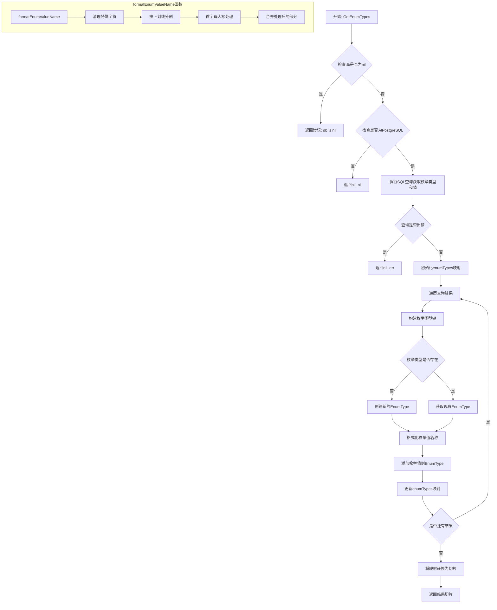
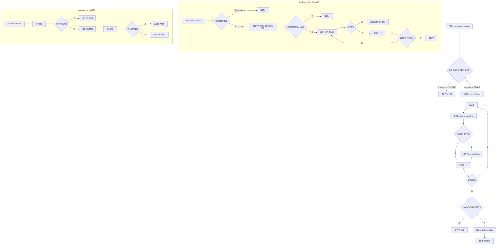
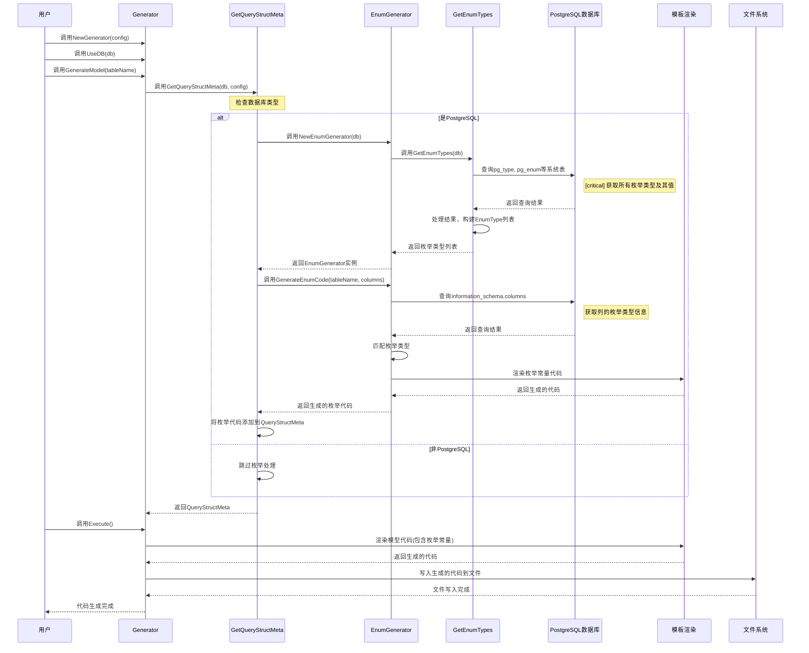

# GetEnumTypes函数实现分析技术报告

## 目录
1. [执行摘要](#执行摘要)
2. [系统理解与模块划分](#系统理解与模块划分)
3. [关键路径与用例清单](#关键路径与用例清单)
4. [函数实现的多层下探流程图](#函数实现的多层下探流程图)
5. [时序图](#时序图)
6. [设计模式与代码风格评估](#设计模式与代码风格评估)
7. [业务逻辑解读](#业务逻辑解读)

## 执行摘要

### 非技术视角
- go-gorm/gen是一个代码生成工具，能将数据库表结构转换为Go代码，提高开发效率
- PostgreSQL枚举类型支持功能允许自动生成Go常量，使代码更安全、更易维护
- 该功能通过数据库元数据查询实现，无需手动编写枚举常量
- 实现方式简洁高效，与现有代码生成流程无缝集成
- 该功能仅支持PostgreSQL数据库，其他数据库不受影响

### 技术视角
- 核心实现基于PostgreSQL系统表查询，获取枚举类型及其值
- 采用模板渲染方式生成Go常量代码，遵循Go命名规范
- 通过修改现有生成流程，在模型生成阶段注入枚举常量代码
- 实现了完整的类型安全检查和错误处理机制
- 代码结构清晰，遵循单一职责原则，易于维护和扩展

## 系统理解与模块划分

go-gorm/gen是一个基于GORM的代码生成工具，旨在通过代码生成提供类型安全的数据库操作API。项目架构分为以下几个主要层次：

### 架构分层
- **用户接口层**：提供Generator对象及其API，用于配置和执行代码生成
- **生成逻辑层**：包含代码生成的核心逻辑，处理数据库元数据到Go代码的转换
- **模板层**：定义生成代码的模板，支持自定义
- **数据库交互层**：基于GORM，负责从数据库获取元数据

### 主要模块及职责
- **generator**：核心生成器，协调整个生成过程
- **internal/generate**：实现具体的代码生成逻辑
- **internal/model**：定义数据模型和数据库交互
- **internal/template**：定义代码模板
- **field**：提供字段操作和查询构建功能

### 数据流与控制流
数据从数据库元数据流向生成的Go代码，控制流从Generator配置开始，经过模型解析、代码生成，最终输出文件。

### 关键服务/包/目录
- **/internal/generate**：核心生成逻辑
- **/internal/model**：数据模型和数据库交互
- **/internal/template**：代码模板
- **/field**：字段操作和查询构建

### 外部依赖
- **gorm.io/gorm**：ORM框架，用于数据库交互
- **text/template**：Go标准库，用于模板渲染
- **golang.org/x/tools/imports**：处理导入语句

## 关键路径与用例清单

### 1. 生成数据库模型代码
- **起点**：用户调用Generator.GenerateModel()
- **终点**：生成的模型代码文件
- **涉及模块**：Generator, internal/generate, internal/model, internal/template
- **外部依赖**：数据库连接

### 2. 生成查询API代码
- **起点**：用户调用Generator.ApplyBasic()
- **终点**：生成的查询API代码文件
- **涉及模块**：Generator, internal/generate, internal/template
- **外部依赖**：无

### 3. PostgreSQL枚举类型常量生成
- **起点**：Generator.GenerateModel()中调用GetQueryStructMeta()
- **终点**：生成的枚举常量代码
- **涉及模块**：internal/generate/enum_generator.go, internal/model/enum_helper.go
- **外部依赖**：PostgreSQL数据库连接

### 4. 执行代码生成
- **起点**：用户调用Generator.Execute()
- **终点**：所有生成的代码文件
- **涉及模块**：Generator, internal/generate
- **外部依赖**：文件系统

## 函数实现的多层下探流程图

### GetEnumTypes函数流程图

### GenerateEnumCode函数流程图

## 时序图

### PostgreSQL枚举类型生成时序图

## 设计模式与代码风格评估

### 使用的设计模式

1. **工厂模式**：`NewEnumGenerator`函数用于创建`EnumGenerator`实例，封装了创建过程的复杂性。

2. **模板方法模式**：通过`renderEnumCode`函数使用Go的`text/template`包渲染枚举常量代码，将算法骨架定义在一个方法中。

3. **策略模式**：通过不同的格式化函数（如`formatEnumValueName`和`formatTableName`）实现不同的命名策略。

4. **单一职责原则**：`EnumGenerator`专注于枚举类型的生成，`GetEnumTypes`专注于从数据库获取枚举类型信息。

### 代码风格评估

**优点**：
- 代码结构清晰，职责划分明确
- 错误处理完善，对各种异常情况都有考虑
- 命名规范，函数和变量名称具有描述性
- 注释充分，说明了函数的用途和实现逻辑

**改进空间**：
1. **错误处理**：在`renderEnumCode`中，模板解析或执行失败时直接返回空字符串，可以考虑返回错误信息以便调试。

2. **配置灵活性**：枚举常量的命名格式目前是硬编码的，可以考虑通过配置项允许用户自定义命名规则。

3. **测试覆盖**：应增加单元测试，特别是对不同数据库方言和边缘情况的测试。

### 可行替代方案

1. **使用代码注释标记**：除了从数据库获取枚举信息，还可以考虑通过代码注释标记的方式定义枚举，类似于protobuf的方式。

2. **集成代码生成工具**：考虑与其他代码生成工具（如stringer）集成，提供更丰富的枚举类型功能。

## 业务逻辑解读

### 核心业务逻辑

1. **枚举类型识别**：
   - 系统通过查询PostgreSQL系统表识别数据库中定义的所有枚举类型
   - 对于每个表的列，检查其是否使用了枚举类型
   - 将匹配的枚举类型与其值关联起来

2. **代码生成规则**：
   - 枚举常量名称遵循Go的命名规范，使用驼峰命名法
   - 表名会被格式化（去除下划线，首字母大写，去除复数形式）
   - 枚举值也会被格式化（特殊字符替换为下划线，按下划线分割后首字母大写）
   - 生成的常量使用字符串类型，值与数据库中定义的枚举值完全一致

3. **集成点**：
   - 在`GetQueryStructMeta`函数中，检测到PostgreSQL数据库时，触发枚举类型处理
   - 生成的枚举代码被添加到`QueryStructMeta`结构体中
   - 在模板渲染阶段，枚举代码被插入到生成的模型代码中

### 领域规则

1. **枚举类型的一致性**：
   - 系统确保生成的Go常量与数据库中定义的枚举值完全一致
   - 当数据库枚举类型变更时，重新生成代码会自动更新常量定义

2. **命名约束**：
   - 生成的常量名称遵循Go的命名规范
   - 表名和枚举值都经过格式化处理，确保生成的代码符合Go的风格指南

3. **数据库方言限制**：
   - 枚举类型支持仅限于PostgreSQL数据库
   - 对于其他数据库，枚举处理逻辑会被跳过，不影响现有功能